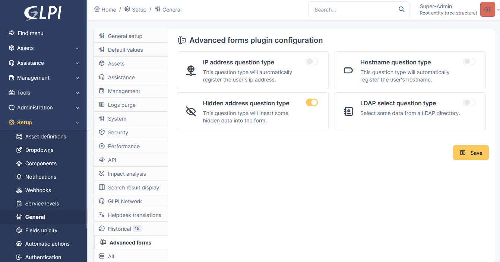
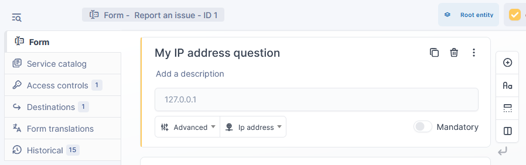
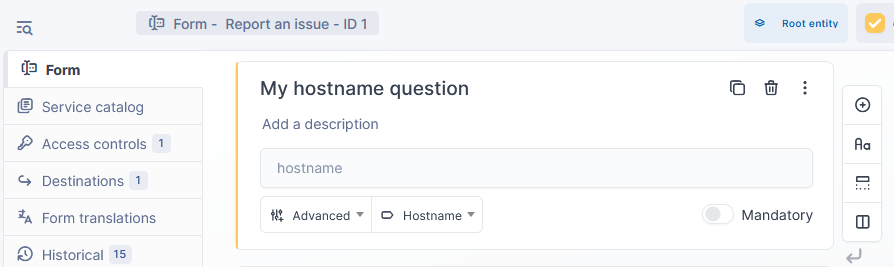
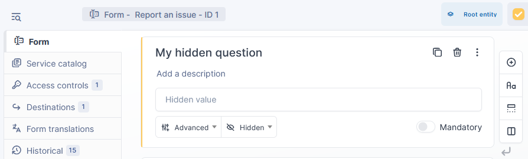
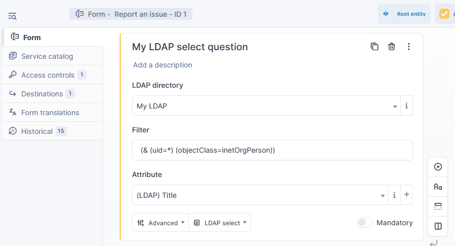

# Advanced Forms GLPI plugin

This plugin add extra features for forms.

## Configuration page

Each features are configurable from the main config page.

## Features

### IP address question

This question won't be displayed to the users.

### Hostname question

This question won't be displayed to the users.
 
 

### Hidden question

This question won't be displayed to the users.

### LDAP select question type

## Contributing

* Open a ticket for each bug/feature so it can be discussed
* Follow [development guidelines](http://glpi-developer-documentation.readthedocs.io/en/latest/plugins/index.html)
* Work on a new branch on your own fork
* Open a PR that will be reviewed by a developer
